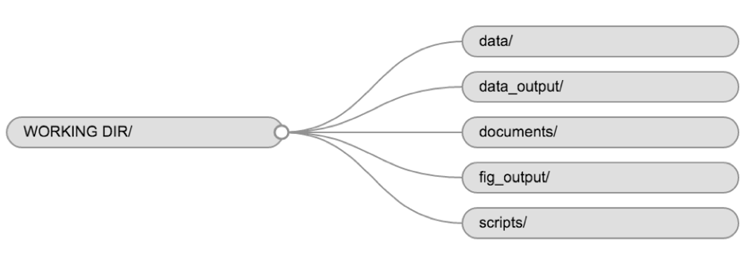
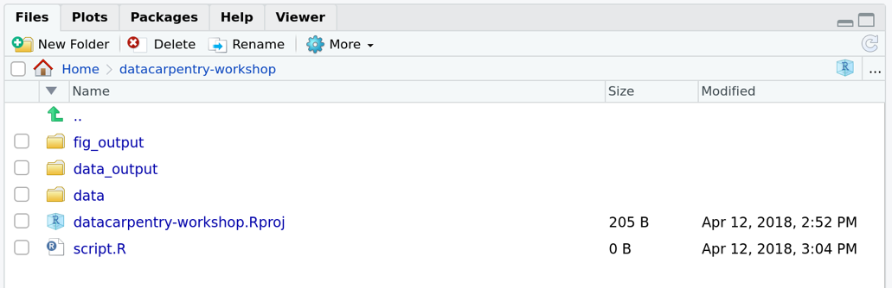
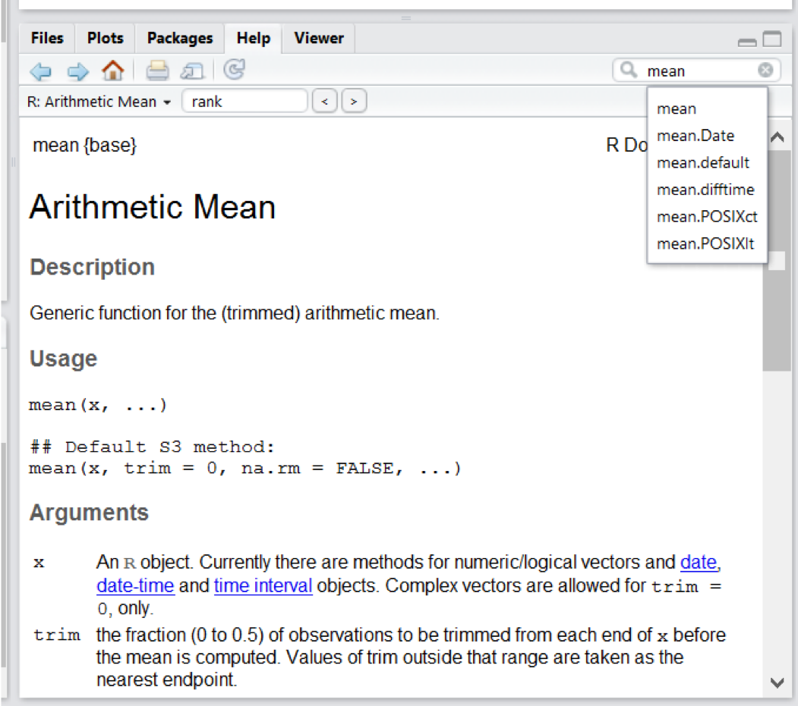

```{r setup, include=FALSE}
options(htmltools.dir.version = FALSE)
```

class: center, middle


# Antes de iniciar

---

# Objetivos de esta sección

1. Describir el propósito y uso de RStudio, un script, la consola, el ambiente y los páneles de gráficos. 

1. Organizar los archivos y directorios para una serie de análisis como un proyecto de R, y entender el propósito del directorio de trabajo.

1. Utilizar funciones de la interface de RStudio para buscar ayuda acerac de las funciones de R.

1. Demostrar cómo podemos consguir información y ayuda en la comunidad de usuarias de R.

---

# ¿Qué es R? ¿qué es RStudio?
 
“R” se refiere al lenguaje de programación R y también al software que interpreta los scripts escritos en dicho lenguaje. 

RStudio es la interface (IDE) más popular de R, que no solo le permite escribir scripts de R, sino que también puede interactuar con funcionalidades para R. RStudio necesita de R, por lo que antes de instalarlo, debe asegurarse que R corre correctamente en su computadora.

---

# ¿Por qué usar R? 

1. R no necesita de "pointing and clicking", y eso es algo bueno

1. El código de R es excelente para la reproducibilidad;

1. R es interdisciplinario y extendible;

1. R trabaja con datos de todas las formas y tamaños;

1. R produce gráficos de alta calidad;

1. R tiene una comunidad grande y muy cálida;

1. No solo R es gratis, sino que también es de código abierto y compatible con todas las plataformas;

---

# Empecemos con RStudio

Cuando abra por primera vez RStudio, será recibida por tres paneles:

* La consola interactiva de R (a la izquierda)

* Ambiente/Historial (en la esquina superior derecha)

* Archivos/Gráficos/Paquetes/Ayuda/Visor (abajo a la derecha)

--

Si abre archivos, como los scripts R, también se abrirá un panel de editor en la esquina superior izquierda.

--

<center> <span style = "font-size: 230%"> ¡Manos a la obra! </span> </center>

---

# Alistemos el espacio de trabajo

Es una buena práctica mantener un conjunto de datos, análisis y texto relacionados en una sola carpeta, llamado directorio de trabajo.

RStudio proporciona un conjunto útil de herramientas para hacer esto a través de su interfaz de "Proyectos", que no solo crea un directorio de trabajo para usted, sino que también recuerda su ubicación. 

---

# Alistemos el espacio de trabajo

¿Cómo podemos crear un proyecto?
1.	En el menú, haga clic File -> New Project. Elija New Directory, y luego New Project.
1.	Ingrese un nombre para esta nueva carpeta (o "directorio"), y elija una ubicación conveniente para ello. Este será su directorio de trabajo por el resto del día (por ejemplo, ~/talleR).
1.	Haga clic en Create Project.
1.	Abra un script de trabajo (File -> New File -> R script), y guárdelo en su directorio de trabajo con el nombre que prefiera (sugerencia: talleR_script.R).
1.	(Opcional) Establezca las Preferencias en "Nunca" guardar el espacio de trabajo en RStudio.

---

# Alistemos el espacio de trabajo

El uso de una estructura de carpetas consistente en sus proyectos ayudará a mantener las cosas organizadas y también facilitará la búsqueda / archivo de las cosas en el futuro. Esto puede ser especialmente útil cuando tienes múltiples proyectos. 

En general, puede crear directorios (carpetas) para scripts , datos y documentos.


---

# Alistemos el espacio de trabajo

Para este taller, necesitaremos las siguientes carpetas:

1. data/: para almacenar nuestros datos sin procesar
1. data_output/: para cuando aprendamos cómo exportar datos como archivos CSV
1. fig_output/: para las figuras que guardaremos

¿Cómo crearlos?

* Files (a la derecha, en el panel de abajo), haga click en New Folder y cree las carpetas que antes mencionamos.

* Alternativamente, puede escribir dir.create("data") en su consola R. 

---

# Alistemos el espacio de trabajo

Vamos a mantener el script en la raíz de nuestro directorio de trabajo porque solo usaremos un archivo y facilitará las cosas.
Su directorio de trabajo ahora debería verse así:



---

# El directorio de trabajo

* Lugar desde donde R buscará y guardará los archivos.
* El uso de proyectos RStudio lo hace fácil y asegura que su directorio de trabajo esté configurado correctamente.
* Si necesita comprobarlo, puede usar getwd().
* Si, por algún motivo, su directorio de trabajo no es el que debería ser, puede cambiarlo en la interfaz RStudio navegando en el buscador de archivos donde debería estar su directorio de trabajo, haciendo clic en el ícono del engranaje azul "More" y seleccionando "Set As Working directory”.
* Alternativamente, puede utilizar setwd("/path/to/working/directory") para restablecer su directorio de trabajo.
* ADVERTENCIA: sus scripts no deben incluir esta línea porque fallarán en la computadora de otra persona.

---

# Interactuando con R

Hay dos formas principales de interactuar con R: 
(1) mediante el uso de la consola o (2) mediante archivos de script (archivos de texto sin formato que contienen su código).

Como queremos que nuestro código y flujo de trabajo sean reproducibles, es mejor escribir los comandos que queremos en el editor de secuencias de comandos y guardar la secuencia de comandos.

RStudio le permite ejecutar comandos directamente desde el editor de secuencias de comandos utilizando el acceso directo Ctrl+Enter (en Mac OS, Cmd+Return también funcionará). 

RStudio proporciona los accesos directos Ctrl+1 y Ctrl+2 que le permiten saltar entre el script y los paneles de la consola.

">" VS "+" 

---

# ¿Cómo aprender más después del taller?

El material que cubrimos durante este taller le dará una idea inicial de cómo puede usar R para analizar datos para su propia investigación o trabajo. 

Sin embargo, tendrá que aprender más para realizar operaciones avanzadas como limpiar su conjunto de datos, usar métodos estadísticos o crear gráficos hermosos. 

La mejor manera de ser competente y eficiente en R, como con cualquier otra herramienta, es usarla para abordar sus preguntas de investigación reales. 

Como principiante, puede ser desalentador tener que escribir un script desde cero, y dado que muchas personas hacen que su código esté disponible en línea, modificar el código existente para que se adapte a su propósito puede hacer que sea más fácil comenzar.
---

# ¿Cómo encuentro ayuda?

Rstudio:



---

# ¿Cómo encuentro ayuda?

* Cuando sé el nombre de la función pero no sé cómo se usa.

* Quiero usar una función que haga X, debe haber una función para ella, pero no sé cuál ...

* Estoy atascada ... Recibo un mensaje de error que no entiendo

* ¿Qué necesito para pedir ayuda?  sessionInfo()

---

# Algunos lineamientos para hacer preguntas en línea

* La clave para recibir ayuda de alguien es que capten rápidamente su problema. 
* Trate de usar las palabras correctas para describir su problema.
* Si es posible, intente reducir lo que no funciona a un ejemplo simple reproducible. 
* Para obtener más información sobre cómo escribir un ejemplo reproducible, consulte este artículo de [Hadley Wickham](http://adv-r.had.co.nz/Reproducibility.html).

---

# ¿Dónde pedir ayuda?

*	La persona sentada a su lado durante el taller.
*	Sus amigas colegas.
*	Si su pregunta es sobre un paquete específico, vea si hay una lista de correo para él. Por lo general, se incluye en el archivo de DESCRIPCIÓN del paquete al que se puede acceder usando packageDescription("name-of-package").
* ¿Otras sugerencias?

---

# Más recursos
*	La [guía de publicación](https://www.r-project.org/posting-guide.html) para las listas de correo de R

*	[Cómo pedir ayuda a R](http://blog.revolutionanalytics.com/2014/01/how-to-ask-for-r-help.html) pautas útiles.

*	[Esta publicación](https://codeblog.jonskeet.uk/2010/08/29/writing-the-perfect-question/) del blog de Jon Skeet tiene consejos bastante completos sobre cómo hacer preguntas de programación.

*	El paquete [reprex](https://cran.rstudio.com/web/packages/reprex/) es muy útil para crear ejemplos reproducibles cuando se solicita ayuda. La [videollamada rOpenSci "Cómo hacer preguntas para que sean respondidas"](https://ropensci.org/commcalls/2017-03-07/), y [la grabación de video](https://vimeo.com/208749032) incluyen una presentación del paquete reprex y de su filosofía.

---


class: center, middle

# ¡vamos al código!

---

class: center, middle

# ¡Gracias!

Sitio creado via el paquete de R  [**xaringan**](https://github.com/yihui/xaringan).

El chakra viene de [remark.js](https://remarkjs.com), [**knitr**](http://yihui.name/knitr), y [R Markdown](https://rmarkdown.rstudio.com).

Las lecciones son de [The Carpentries](https://datacarpentry.org/R-ecology-lesson/)


